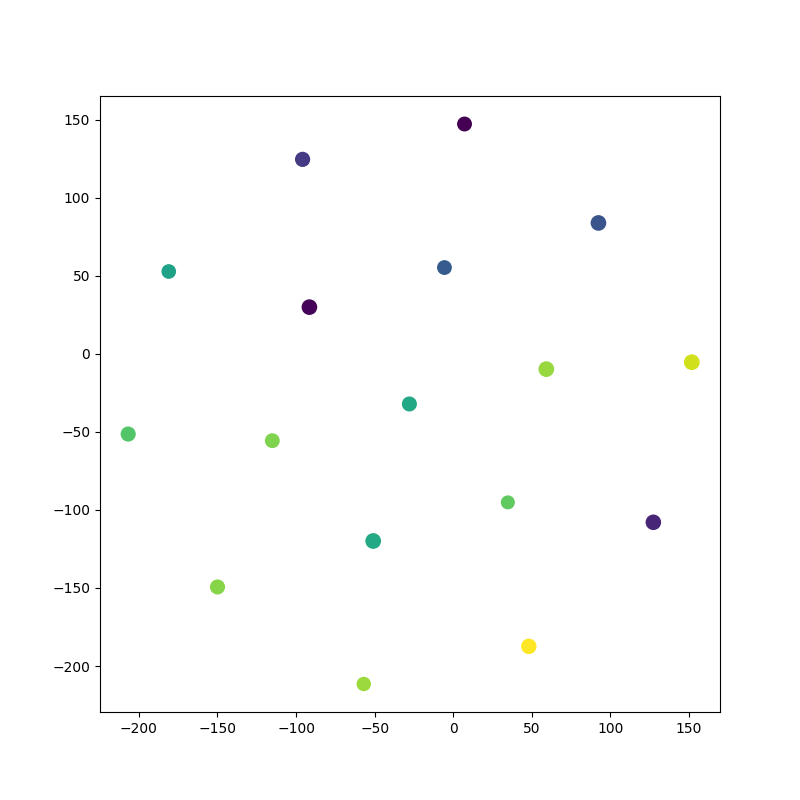

Triplet loss for facial recognition.

# Triplet Face

The repository contains code for the application of triplet loss training to the
task of facial recognition. This code has been produced for a lecture and is not
going to be maintained in any sort.


## Architecture

The proposed architecture is pretty simple and does not implement state of the
art performances. The chosen architecture is a fine tuning example of the
inception_V3 CNN model. The model includes the freezed CNN part of inception, and its
FC part has been replaced to be trained to output latent variables for the
facial image input.

The choice of Inception_V3 was made after comparaison of all CNN models availables
in the library torchvision. This model is currently the one with the best result.

The dataset needs to be formatted in the following form:
```
dataset/
| test/
| | 0/
| | | 00563.png
| | | 01567.png
| | | ...
| | 1/
| | | 00011.png
| | | 00153.png
| | | ...
| | ...
| train/
| | 0/
| | | 00001.png
| | | 00002.png
| | | ...
| | 1/
| | | 00001.png
| | | 00002.png
| | | ...
| | ...
| labels.csv        # id;label
```

## Install

Install all dependencies ( pip command may need sudo ):
```bash
cd TripletFace/
pip3 install -r requirements.txt
```

## Usage

For training:
```bash
usage: train.py [-h] -s DATASET_PATH -m MODEL_PATH [-i INPUT_SIZE]
                [-z LATENT_SIZE] [-b BATCH_SIZE] [-e EPOCHS]
                [-l LEARNING_RATE] [-w N_WORKERS] [-r N_SAMPLES]

optional arguments:
  -h, --help            show this help message and exit
  -s DATASET_PATH, --dataset_path DATASET_PATH
  -m MODEL_PATH, --model_path MODEL_PATH
  -i INPUT_SIZE, --input_size INPUT_SIZE
  -z LATENT_SIZE, --latent_size LATENT_SIZE
  -b BATCH_SIZE, --batch_size BATCH_SIZE
  -e EPOCHS, --epochs EPOCHS
  -l LEARNING_RATE, --learning_rate LEARNING_RATE
  -w N_WORKERS, --n_workers N_WORKERS
  -r N_SAMPLES, --n_samples N_SAMPLES
```

The current model.pt is the result of precedent try.

## JIT compile

To JIT compile the model:
  - Train the model
  - Jun the jit.py
The jit compile will create a "scriptmodule.pt". it must be run independently of
the training to cluster all options.

## Centroid and treshold

It is possible to generate a centroid and treshold for each peoples in the dataset
with the script "peoples_data.py". It takes the sames arguments as for training and
generate a centroids, treshold and visualization of them, centroid is the position and treshold the size.
All of them are in the folder "peoples_data".
Centroid is a mean of positions of the tensors. treshold is the sum of all of them divided by 0.5 to
minimize it.the hyperparameter has been found by testing in order to get a great visualization



## Inference

The inference script currently doesn't works. It use the cam of the computer to
identify you dynamically.


## References

* Resnet Paper: [Arxiv](https://arxiv.org/pdf/1512.03385.pdf)
* Triplet Loss Paper: [Arxiv](https://arxiv.org/pdf/1503.03832.pdf)
* TripletTorch Helper Module: [Github](https://github.com/TowardHumanizedInteraction/TripletTorch)
